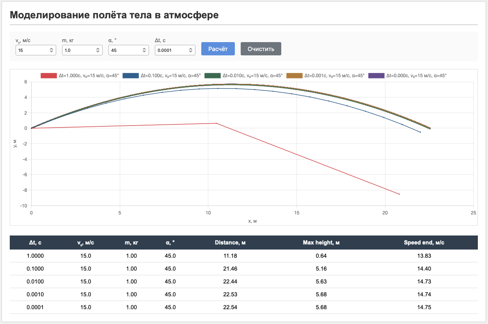

# Отчёт по лабораторной работе
## Моделирование полёта тела в атмосфере

### Результаты моделирования

**Таблица 1 – Результаты расчётов при различных шагах интегрирования**

| Δt, c | v₀, м/с | m, кг | α, ° | Distance, м | Max height, м | Speed end, м/с |
|-------|---------|-------|------|-------------|---------------|----------------|
| 1.0000 | 15.0 | 1.00 | 45.0 | 11.18 | 0.64 | 13.83 |
| 0.1000 | 15.0 | 1.00 | 45.0 | 21.46 | 5.16 | 14.40 |
| 0.0100 | 15.0 | 1.00 | 45.0 | 22.44 | 5.63 | 14.73 |
| 0.0010 | 15.0 | 1.00 | 45.0 | 22.53 | 5.68 | 14.74 |
| 0.0001 | 15.0 | 1.00 | 45.0 | 22.54 | 5.68 | 14.75 |

### Вывод

При уменьшении шага интегрирования наблюдается сходимость решения к предельным значениям. При шаге Δt = 1.0 с погрешность составляет более 50% (дальность 11.18 м вместо 22.54 м при шаге 0.0001 с), что делает такой шаг неприемлемым для моделирования. Начиная с шага 0.01 результаты изменяются незначительно (менее 0.5%), что приемлемо для практических расчётов. Оптимальным шагом для данной модели можно принять Δt = 0.01–0.001 с.